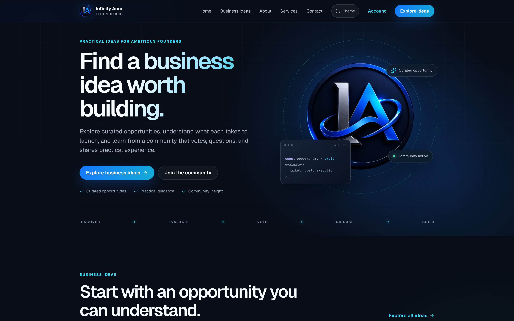
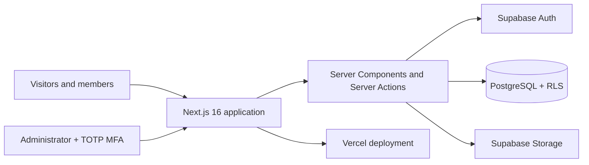

# Infinity Aura Technologies

<div align="center">

**A full-stack business ideas community, corporate website, CMS, and lead-management platform.**

[View the live application](https://www.infinityaura.tech/) · [Explore the source](https://github.com/Janvierscode/infinity_aura)

</div>



## About the project

Infinity Aura is a production-deployed web platform that helps aspiring founders discover practical business opportunities, evaluate what each idea takes to launch, and learn from community feedback. It also presents Infinity Aura's technology services and gives the team a secure back office for publishing content, moderating discussions, managing media, and following up on enquiries.

This project demonstrates my ability to take a product from concept to deployment: designing a responsive interface, building authenticated user journeys, modelling a relational database, enforcing authorization at the data layer, developing content-management workflows, testing critical behavior, and operating the application in production.

## What I built

### Public experience

- Responsive corporate website with Home, About, Services, Business Ideas, Contact, Privacy, and Terms pages
- Curated business idea catalogue with category filtering and newest/top-voted sorting
- Image-first idea cards and detail views with responsive covers, accessible fallbacks, and paginated data loading
- Public idea previews with complete guides reserved for signed-in members
- Dynamic service and idea detail pages backed by Supabase content
- Accessible mobile navigation and persistent Light, Dark, and System themes
- Contact form with inline validation, bot protection, and private CRM submission
- Dynamic metadata, Open Graph data, sitemap, robots rules, custom 404, loading states, and error boundaries

### Community platform

- Email/password registration, email confirmation, sign-in, sign-out, and password recovery
- Optional Google OAuth sign-in
- Member profiles and account management
- Upvotes and downvotes on ideas and comments, including vote switching and removal
- Community comments with ownership-based deletion
- Authentication gates that preserve the member's intended return destination
- Private individual vote records with public aggregate totals

### Secure administration

- Protected dashboard for ideas, categories, services, leads, media, and site settings
- Draft, published, and archived content workflows with cover images required before publication
- Markdown editors with live previews for public and member-only content
- Comment moderation with hide, restore, and permanent-delete actions
- Lightweight CRM with lead statuses, private notes, and direct email follow-up
- Supabase Storage media library with automatic WebP optimization, accessible metadata, clear upload feedback, and reference-safe deletion
- Singleton administrator authorization with mandatory TOTP multi-factor authentication

## Engineering skills demonstrated

- **Full-stack development:** React Server Components, Client Components, Server Actions, dynamic routes, form workflows, and cache invalidation
- **Database engineering:** PostgreSQL schema design, relationships, enums, indexes, triggers, aggregate counters, migrations, seed data, and RPC functions
- **Authentication and authorization:** SSR-compatible sessions, email and OAuth flows, password recovery, role checks, MFA/AAL2 enforcement, and ownership policies
- **Application security:** Row Level Security, least-privilege database grants, server-side validation, sanitized Markdown, safe redirects, honeypot protection, and protected member content
- **UI/UX engineering:** responsive layouts, accessible controls, theme persistence without a flash of incorrect theme, purposeful loading/error states, and mobile-first testing
- **Quality assurance:** unit, component, integration, and end-to-end testing across desktop and mobile viewports
- **Performance and SEO:** server rendering, tagged data caching, targeted revalidation, optimized images, canonical metadata, Open Graph previews, sitemap, and robots configuration
- **Deployment:** environment-aware configuration, Supabase-managed backend services, and Vercel deployment in the London region

## Technology stack

| Area | Tools and technologies |
| --- | --- |
| Frontend | Next.js 16 App Router, React 19, TypeScript 6, CSS, Lucide React |
| Backend | Next.js Server Actions, Server Components, Supabase JS, Supabase SSR |
| Database | PostgreSQL 17, SQL migrations, functions, triggers, indexes, Row Level Security |
| Authentication | Supabase Auth, email/password, Google OAuth, TOTP MFA |
| Content | React Markdown, GitHub Flavored Markdown, rehype-sanitize |
| Validation | Zod 4, HTML form constraints, database constraints |
| Storage | Supabase Storage, Sharp, Next.js Image |
| Testing | Vitest, React Testing Library, Playwright |
| Code quality | ESLint 9, TypeScript strict checking |
| Tooling | Node.js 22+, npm, Supabase CLI, Git, GitHub, Turbopack |
| Deployment | Vercel, Supabase, custom domain and HTTPS |

## Architecture



The application uses Next.js for rendering, routing, metadata, mutations, and cache management. Supabase provides the system of record, authentication, and object storage. Authorization is enforced in PostgreSQL with RLS as well as in the application, so access control does not rely on hidden UI alone.

## Security decisions

- Public visitors can read only published content and visible community data.
- Complete idea guides are protected at the database level and are not included in anonymous responses.
- Community members can modify only their own profiles, comments, and vote records.
- CRM records, drafts, media management, and CMS mutations require the designated administrator and an AAL2 session.
- The contact form writes through a narrowly granted, validated PostgreSQL function; anonymous users cannot read lead records.
- Markdown output is sanitized, dangerous protocols are rejected, and inline images require HTTPS.
- Uploaded media is restricted to JPEG, PNG, WebP, and AVIF files up to 10 MiB.
- Referenced media cannot be deleted until it has been detached from published content or settings.

## Testing

The repository includes focused unit/component tests and browser-level coverage for both desktop Chrome and an iPhone-sized viewport. The test suite covers validation, URL safety, vote behavior, theme resolution, Markdown sanitization, responsive overflow, navigation, redirects, authentication gates, protected content, contact-form behavior, and admin route protection.

```bash
npm run lint       # ESLint
npm run typecheck  # TypeScript
npm test           # Vitest unit and component tests
npm run test:e2e   # Playwright desktop and mobile tests
```

## Run locally

### Prerequisites

- Node.js 24
- npm
- Docker Desktop or another Docker-compatible runtime for local Supabase

### 1. Install dependencies

```bash
git clone https://github.com/Janvierscode/infinity_aura.git
cd infinity_aura
npm install
```

### 2. Start Supabase and prepare the database

```bash
npm run supabase:start
npm run supabase:reset
```

The reset command applies every migration in `supabase/migrations` and loads the development content from `supabase/seed.sql`.

### 3. Configure the application

Create `.env.local` in the project root using the local values reported by Supabase:

```env
NEXT_PUBLIC_SUPABASE_URL=http://127.0.0.1:54321
NEXT_PUBLIC_SUPABASE_PUBLISHABLE_KEY=your-local-publishable-key
NEXT_PUBLIC_SITE_URL=http://localhost:3000
NEXT_PUBLIC_GOOGLE_AUTH_ENABLED=false
```

No service-role key is used by the application. Database access is performed with the current visitor's or member's session and governed by RLS.

### 4. Start the development server

```bash
npm run dev
```

Open [http://localhost:3000](http://localhost:3000). Local Supabase Studio is available at [http://localhost:54323](http://localhost:54323).

### Optional: enable local admin access

Create an Auth user in Supabase Studio, then assign that user's ID as the single administrator from the Studio SQL editor:

```sql
insert into private.app_admin (user_id)
select id from auth.users where email = 'admin@example.com';
```

Sign in at `/admin/login`; the application will guide the administrator through TOTP enrolment before allowing access to protected data.

To enable Google sign-in, configure the Google provider and callback URLs in Supabase Auth, then set `NEXT_PUBLIC_GOOGLE_AUTH_ENABLED=true`.

## Project structure

```text
src/
├── app/                 # Public, account, auth, and protected admin routes
├── components/          # Site, community, admin, and shared UI components
├── features/            # Auth, community, content, and enquiry Server Actions
├── lib/                 # Supabase clients, caching, validation, and utilities
└── types/               # Application-facing database types
supabase/
├── migrations/          # Versioned schema, security, and performance changes
├── tests/               # SQL/RLS smoke tests
└── seed.sql             # Reproducible local content
tests/e2e/               # Playwright public-site and access-control scenarios
public/                  # Brand assets and project screenshot
```

## Available commands

| Command | Purpose |
| --- | --- |
| `npm run dev` | Start the Next.js development server |
| `npm run build` | Create a production build |
| `npm run start` | Run the production server |
| `npm run lint` | Check the codebase with ESLint |
| `npm run typecheck` | Run TypeScript without emitting files |
| `npm test` | Run the Vitest suite once |
| `npm run test:watch` | Run Vitest in watch mode |
| `npm run test:e2e` | Build and run Playwright tests |
| `npm run supabase:start` | Start the local Supabase stack |
| `npm run supabase:stop` | Stop the local Supabase stack |
| `npm run supabase:reset` | Rebuild and seed the local database |
| `npm run supabase:types` | Generate TypeScript types from the local schema |

## Deployment

The live application is deployed on Vercel and backed by Supabase:

**[https://www.infinityaura.tech/](https://www.infinityaura.tech/)**

Production requires the three public environment variables shown above, with `NEXT_PUBLIC_SITE_URL` set to the canonical HTTPS domain. Supabase Auth redirect URLs must include the production domain and `/auth/callback`.

---

Built by [Janvier Karemy](https://github.com/Janvierscode) as an end-to-end demonstration of product thinking, full-stack engineering, secure data design, and production delivery.
