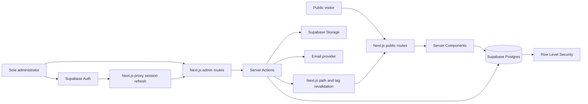

# Infinity Aura Technologies - Phase 2 Web Application Plan

Document status: Proposed implementation blueprint  
Prepared: 12 August 2026  
Target stack: Next.js, TypeScript, Supabase, Vercel

## 1. Executive Summary

Phase 2 will convert the current static corporate website into a production-grade,
content-managed web application. The public website will retain the existing dark,
premium Infinity Aura visual identity, while all business content becomes editable
through a secure administration area.

The application will have exactly one authorized administrator. There will be no
public registration, no customer accounts, and no multi-user permissions in the
initial release. The administrator will be able to manage public content, media,
SEO, navigation, contact information, social links, publication state, and contact
enquiries without editing source code.

Supabase will be the system of record for content, authentication, media metadata,
and enquiries. Next.js will render the public site and admin application, enforce
server-side validation and route protection, and refresh public content when the
administrator publishes a change. Vercel is the recommended hosting platform.

This plan treats "everything dynamic" as the following requirement:

- Every meaningful text, link, image, ordering value, visibility state, and SEO
  field on the existing public website is editable in the admin application.
- Repeatable content such as services, solutions, statistics, technologies,
  testimonials, navigation items, and social links is stored as database records.
- Content changes support draft, preview, publish, and rollback workflows.
- Contact submissions are stored in the database and visible in an admin inbox.
- The public site never depends on hard-coded business content to render normally.

## 2. Current State

The existing repository is a static site composed of:

- `index.html`
- `css/style.css`
- `js/script.js`
- Brand assets in `assets/images/` and `assets/icons/`

The current public experience already includes:

- Hero content and calls to action
- About, mission, vision, and values
- Eight service cards
- Business statistics
- Four featured solutions
- Technology categories and technology cards
- Placeholder testimonials
- Contact information and enquiry form
- Footer navigation and social links
- Responsive navigation, animations, counters, SEO metadata, and structured data

Phase 2 is a migration, not a visual reset. The existing design is the baseline to
preserve and improve.

## 3. Product Goals

### 3.1 Primary Goals

1. Give the business owner full control over public website content.
2. Protect all administrative functions with Supabase Auth and database-level
   authorization.
3. Make public content fast, SEO-friendly, accessible, and reliable.
4. Store contact enquiries in a durable, searchable admin inbox.
5. Support professional draft, preview, publish, revision, and audit workflows.
6. Establish a maintainable foundation for future products, case studies, and
   business growth.

### 3.2 Success Measures

- The administrator can change every public content area without a code change.
- Published edits appear on the public website within seconds.
- Draft content is never visible to anonymous visitors.
- A non-admin account cannot access admin pages or mutate content, even by calling
  Supabase directly.
- Contact submissions are validated, stored, acknowledged, and visible in admin.
- The application passes production build, type, lint, unit, integration, and
  critical end-to-end checks.
- Public pages meet WCAG 2.2 AA expectations and have no horizontal overflow at
  supported mobile, tablet, and desktop widths.
- Core public pages achieve a Lighthouse target of at least 90 for performance,
  accessibility, best practices, and SEO under normal production conditions.

### 3.3 Non-Goals for the Initial Phase 2 Release

- Customer, school, employee, or partner portals
- Public user registration
- Multiple admin roles or editorial approval chains
- E-commerce, subscriptions, or online payments
- A full school management system inside the corporate website
- Native mobile applications
- A general-purpose page builder with arbitrary components
- Real-time collaborative editing

These can be added later without weakening the Phase 2 foundation.

## 4. Users and Permissions

### 4.1 Public Visitor

Can:

- View published pages, services, solutions, testimonials, technologies, and
  company information
- Submit a contact enquiry
- Use public contact and social links

Cannot:

- View drafts or unpublished records
- Access admin routes
- List private media or contact enquiries
- Write directly to content tables

### 4.2 Sole Administrator

Can:

- Sign in through a private admin login
- View the dashboard and content health information
- Create, edit, reorder, hide, publish, unpublish, archive, and restore content
- Upload, replace, describe, and delete unused media
- Preview draft content before publication
- Read and manage contact enquiries
- Edit navigation, company details, SEO defaults, and social links
- Review revision history and audit activity
- Sign out and manage MFA

The first release supports one administrator only. Public signup is disabled. The
admin account is created manually and bound to a singleton authorization record in
the database.

## 5. Functional Scope

### 5.1 Dynamic Public Website

The homepage remains the primary conversion page and is assembled from published
content records. The following existing modules become dynamic:

| Public area | Editable fields |
| --- | --- |
| Header | Logo, navigation items, labels, URLs, order, visibility, CTA |
| Hero | Eyebrow, headline, accent line, summary, CTAs, proof points, media |
| About | Section label, heading, lead, body, values |
| Mission and vision | Icon, title, text, order, visibility |
| Services | Icon, title, slug, summary, body, featured flag, order, status |
| Why choose us | Heading, description, CTA, statistics, suffixes, order |
| Solutions | Category, title, slug, summary, body, media, featured flag, order |
| Technologies | Category, name, short mark/logo, order, visibility |
| Testimonials | Quote, person, role/company, avatar, order, approval state |
| Contact | Heading, body, email, phone, address, response expectation |
| Footer | Brand copy, quick links, service links, social links, legal copy |
| SEO | Page title, description, OG image, canonical URL, robots state |

### 5.2 Public Routes

Recommended public route map:

| Route | Purpose | Rendering |
| --- | --- | --- |
| `/` | Dynamic homepage | Cached Server Component |
| `/about` | Expanded company profile | Cached Server Component |
| `/services` | Published service index | Cached Server Component |
| `/services/[slug]` | Service detail and enquiry CTA | Cached dynamic route |
| `/solutions` | Published solution index | Cached Server Component |
| `/solutions/[slug]` | Solution detail and enquiry CTA | Cached dynamic route |
| `/contact` | Dedicated enquiry page | Server Component + Server Action |
| `/privacy` | Privacy notice | Cached Server Component |
| `/terms` | Terms or website terms | Cached Server Component |
| `/sitemap.xml` | Dynamic search sitemap | Next.js metadata route |
| `/robots.txt` | Search crawler policy | Next.js metadata route |

The homepage can continue displaying service and solution summaries. Detail routes
provide better SEO, shareable URLs, and enough room for persuasive long-form copy.

### 5.3 Admin Application

Recommended admin route map:

| Route | Purpose |
| --- | --- |
| `/admin/login` | Private email/password login |
| `/admin/mfa` | TOTP enrolment or challenge |
| `/admin` | Dashboard |
| `/admin/pages` | Page and section overview |
| `/admin/pages/[id]` | Page metadata and section editor |
| `/admin/services` | Service list, filters, ordering, status |
| `/admin/services/new` | Create a service |
| `/admin/services/[id]` | Edit, preview, publish, archive |
| `/admin/solutions` | Solution list and ordering |
| `/admin/solutions/[id]` | Edit, preview, publish, archive |
| `/admin/technologies` | Technology categories and items |
| `/admin/testimonials` | Testimonial management |
| `/admin/media` | Media library |
| `/admin/enquiries` | Searchable enquiry inbox |
| `/admin/enquiries/[id]` | Enquiry detail and status history |
| `/admin/navigation` | Header and footer navigation |
| `/admin/settings` | Company, contact, social, and SEO defaults |
| `/admin/revisions` | Content revision history |
| `/admin/activity` | Audit log |

### 5.4 Admin Dashboard

The dashboard should show actionable information rather than decorative charts:

- Published, draft, and archived content counts
- Unread and unresolved enquiry counts
- Recent enquiries
- Recently updated content
- Missing SEO descriptions or media alt text
- Broken or empty public links detected by validation
- Storage usage summary
- Last successful publication and last admin sign-in

### 5.5 Content Editing Workflow

Each editor follows a consistent workflow:

1. Open or create a record.
2. Edit validated fields.
3. Save as draft.
4. Preview the complete public presentation through a signed preview URL.
5. Publish immediately or schedule publication in a later enhancement.
6. Trigger cache invalidation for affected public routes and data tags.
7. Store an immutable revision snapshot and audit event.
8. Allow restoration of a prior revision as a new draft.

The initial release uses explicit Save Draft and Publish actions. Autosave can be
added later after conflict, recovery, and accidental-overwrite behavior is designed.

### 5.6 Media Library

The administrator can:

- Upload JPG, PNG, WebP, AVIF, and SVG files subject to validation
- View filename, type, dimensions, size, alt text, caption, and usage state
- Search and filter media
- Replace a file while preserving or intentionally changing references
- Copy a public URL
- Delete only files that are not referenced, unless a replacement is selected

Public marketing media will use a `public-media` Supabase Storage bucket. Object
write policies are restricted to the sole admin. Public reads are allowed, but
bucket listing is not exposed to anonymous users. Upload limits and MIME checks are
enforced in both the application and Storage policies.

### 5.7 Contact Enquiry Workflow

The current FormSubmit dependency will be replaced.

Submission flow:

1. Visitor submits name, email, optional phone, topic/service, and message.
2. A Next.js Server Action validates and normalizes all fields with Zod.
3. Honeypot, request-size, origin, and rate-limit checks run before persistence.
4. A server-only Supabase client inserts the enquiry.
5. The visitor receives an on-page success state and reference number.
6. A notification email is sent to the business mailbox through a transactional
   email provider; failure to send the notification does not discard the enquiry.
7. The admin inbox shows the new enquiry as unread.

Admin enquiry states:

- `new`
- `read`
- `in_progress`
- `replied`
- `closed`
- `spam`

The admin can add an internal note, assign a status, copy contact details, and open
a pre-addressed reply in the configured mail client. The first release does not
send replies from inside the admin application.

## 6. Technical Architecture



### 6.1 Recommended Stack

| Concern | Decision |
| --- | --- |
| Framework | Current stable Next.js App Router |
| Language | TypeScript with strict mode |
| Runtime | Node.js 22 or later; Node runtime by default |
| UI | React Server Components plus focused Client Components |
| Styling | Tailwind CSS with CSS variables and reusable design tokens |
| Admin components | shadcn/ui primitives adapted to the Infinity Aura system |
| Forms | React Hook Form where rich client behavior is needed; server validation always |
| Validation | Zod shared schemas at every mutation boundary |
| Database | Supabase Postgres |
| Authentication | Supabase Auth with cookie-based SSR |
| File storage | Supabase Storage |
| Database access | `@supabase/supabase-js` and `@supabase/ssr` |
| Schema workflow | Supabase CLI migrations and generated TypeScript database types |
| Hosting | Vercel |
| Unit tests | Vitest and Testing Library |
| End-to-end tests | Playwright |
| Monitoring | Vercel logs/analytics, Supabase logs/advisors, optional Sentry |

Package versions must be pinned with a committed lockfile. At implementation time,
versions are selected from current stable releases after reviewing the Supabase
changelog. Supabase client libraries require Node.js 22 or newer as of mid-2026,
so Node.js 22 is the project baseline.

### 6.2 Next.js Rendering Boundaries

- Public reads occur in Server Components. There is no internal REST round trip.
- Admin mutations and contact submission use Server Actions.
- Route Handlers are reserved for auth callbacks, health checks, webhooks, and any
  future external API consumers.
- Interactive controls, drag/reorder interfaces, dialogs, and rich form behavior
  are isolated Client Components.
- Admin routes are dynamic and never publicly cached.
- Published public content is cached and tagged by content type.
- Publishing calls `revalidatePath` for affected URLs and revalidates shared tags.
- The default Node.js runtime is used unless a measured requirement justifies Edge.

### 6.3 Proposed Next.js Structure

```text
src/
├── app/
│   ├── (site)/
│   │   ├── layout.tsx
│   │   ├── page.tsx
│   │   ├── about/page.tsx
│   │   ├── services/page.tsx
│   │   ├── services/[slug]/page.tsx
│   │   ├── solutions/page.tsx
│   │   ├── solutions/[slug]/page.tsx
│   │   └── contact/page.tsx
│   ├── admin/
│   │   ├── (auth)/login/page.tsx
│   │   ├── (auth)/mfa/page.tsx
│   │   └── (protected)/
│   │       ├── layout.tsx
│   │       ├── page.tsx
│   │       ├── pages/
│   │       ├── services/
│   │       ├── solutions/
│   │       ├── technologies/
│   │       ├── testimonials/
│   │       ├── media/
│   │       ├── enquiries/
│   │       ├── navigation/
│   │       ├── revisions/
│   │       ├── activity/
│   │       └── settings/
│   ├── auth/callback/route.ts
│   ├── preview/route.ts
│   ├── robots.ts
│   ├── sitemap.ts
│   ├── error.tsx
│   ├── global-error.tsx
│   ├── not-found.tsx
│   └── layout.tsx
├── components/
│   ├── site/
│   ├── admin/
│   ├── forms/
│   └── ui/
├── features/
│   ├── auth/
│   ├── content/
│   ├── enquiries/
│   ├── media/
│   └── publishing/
├── lib/
│   ├── supabase/client.ts
│   ├── supabase/server.ts
│   ├── supabase/admin.ts
│   ├── auth.ts
│   ├── cache.ts
│   ├── env.ts
│   └── validation/
├── styles/
│   └── globals.css
└── types/
    └── database.ts
supabase/
├── config.toml
├── migrations/
├── seed.sql
└── tests/
```

`lib/supabase/admin.ts` is server-only and may use a Supabase secret key for narrow
system operations. It must never be imported by a Client Component or exposed as a
`NEXT_PUBLIC_` environment variable.

## 7. Data Model

### 7.1 Modeling Principles

- Use normalized tables for searchable and repeatable business entities.
- Use JSONB only for bounded presentation configuration that does not need joins,
  filtering, constraints, or individual permissions.
- Use lowercase `snake_case` identifiers.
- Use UUID primary keys generated by Postgres.
- Store all timestamps as `timestamptz` in UTC.
- Add `created_at`, `updated_at`, and `updated_by` to admin-managed records.
- Add explicit constraints for status values, sort order, slugs, and required text.
- Index every foreign key and every column used frequently by RLS, filters, or
  ordering.
- Use soft archive state for business content; hard delete only unused media and
  confirmed disposable records.

### 7.2 Core Tables

#### `site_settings`

Singleton global configuration.

- `id boolean primary key default true check (id)`
- `company_name text not null`
- `tagline text not null`
- `legal_name text`
- `public_email text not null`
- `enquiry_email text not null`
- `phone text`
- `address_line text`
- `city text`
- `country_code char(2)`
- `timezone text default 'Africa/Harare'`
- `website_url text`
- `default_meta_title text`
- `default_meta_description text`
- `default_og_media_id uuid`
- `logo_media_id uuid`
- `icon_media_id uuid`
- audit timestamps and admin reference

#### `pages`

- `id uuid primary key`
- `slug text unique not null`
- `name text not null`
- `status content_status not null default 'draft'`
- `meta_title text`
- `meta_description text`
- `canonical_url text`
- `og_media_id uuid`
- `robots_index boolean default true`
- `published_at timestamptz`
- audit timestamps and admin reference

#### `page_sections`

- `id uuid primary key`
- `page_id uuid not null references pages(id)`
- `section_key text not null`
- `section_type section_type not null`
- `eyebrow text`
- `heading text`
- `accent_text text`
- `body text`
- `primary_cta_label text`
- `primary_cta_url text`
- `secondary_cta_label text`
- `secondary_cta_url text`
- `media_id uuid`
- `settings jsonb not null default '{}'`
- `sort_order integer not null default 0`
- `is_visible boolean not null default true`
- unique `(page_id, section_key)`
- audit timestamps and admin reference

#### `services`

- `id uuid primary key`
- `slug text unique not null`
- `title text not null`
- `summary text not null`
- `body text not null`
- `icon_key text`
- `hero_media_id uuid`
- `is_featured boolean default false`
- `status content_status default 'draft'`
- `sort_order integer default 0`
- `meta_title text`
- `meta_description text`
- `published_at timestamptz`
- audit timestamps and admin reference

#### `solutions`

Same publication and SEO fields as `services`, plus:

- `category text`
- `challenge text`
- `approach text`
- `benefits jsonb default '[]'`
- `gallery jsonb default '[]'` or a normalized `solution_media` join table

Use a normalized join table if images need independent ordering, captions, or reuse.

#### `stat_items`

- `id uuid primary key`
- `section_id uuid references page_sections(id)`
- `label text not null`
- `value numeric not null`
- `prefix text`
- `suffix text`
- `description text`
- `sort_order integer default 0`
- `is_visible boolean default true`

#### `technology_categories`

- `id uuid primary key`
- `name text unique not null`
- `slug text unique not null`
- `sort_order integer default 0`
- `is_visible boolean default true`

#### `technologies`

- `id uuid primary key`
- `category_id uuid not null references technology_categories(id)`
- `name text not null`
- `short_mark text`
- `logo_media_id uuid`
- `website_url text`
- `sort_order integer default 0`
- `is_visible boolean default true`

#### `testimonials`

- `id uuid primary key`
- `quote text not null`
- `person_name text not null`
- `person_role text`
- `organization text`
- `avatar_media_id uuid`
- `is_approved boolean default false`
- `is_featured boolean default false`
- `sort_order integer default 0`
- `published_at timestamptz`
- audit timestamps and admin reference

#### `navigation_items`

- `id uuid primary key`
- `location navigation_location not null`
- `label text not null`
- `url text not null`
- `parent_id uuid references navigation_items(id)`
- `open_in_new_tab boolean default false`
- `sort_order integer default 0`
- `is_visible boolean default true`

#### `social_links`

- `id uuid primary key`
- `platform text not null`
- `label text not null`
- `url text not null`
- `icon_key text not null`
- `sort_order integer default 0`
- `is_visible boolean default true`

#### `media_assets`

- `id uuid primary key`
- `bucket text not null`
- `object_path text unique not null`
- `public_url text not null`
- `original_filename text not null`
- `mime_type text not null`
- `size_bytes bigint not null`
- `width integer`
- `height integer`
- `alt_text text`
- `caption text`
- `uploaded_by uuid not null`
- `created_at timestamptz default now()`

#### `contact_enquiries`

- `id uuid primary key`
- `reference_number text unique not null`
- `name text not null`
- `email text not null`
- `phone text`
- `organization text`
- `service_id uuid references services(id)`
- `subject text`
- `message text not null`
- `status enquiry_status default 'new'`
- `source_path text`
- `utm_source text`
- `utm_medium text`
- `utm_campaign text`
- `notification_status notification_status default 'pending'`
- `internal_note text`
- `read_at timestamptz`
- `closed_at timestamptz`
- `created_at timestamptz default now()`

Do not store raw IP addresses indefinitely. If rate limiting requires an identifier,
use a short-lived keyed hash and define a deletion policy.

#### `content_revisions`

- `id uuid primary key`
- `entity_type text not null`
- `entity_id uuid not null`
- `revision_number integer not null`
- `snapshot jsonb not null`
- `change_summary text`
- `created_by uuid not null`
- `created_at timestamptz default now()`
- unique `(entity_type, entity_id, revision_number)`

#### `audit_logs`

- `id bigint generated always as identity primary key`
- `actor_id uuid`
- `action text not null`
- `entity_type text not null`
- `entity_id uuid`
- `metadata jsonb default '{}'`
- `created_at timestamptz default now()`

Audit logs are append-only from the application. The admin can view but not edit or
delete them through the UI.

### 7.3 Recommended Enums

- `content_status`: `draft`, `published`, `archived`
- `enquiry_status`: `new`, `read`, `in_progress`, `replied`, `closed`, `spam`
- `notification_status`: `pending`, `sent`, `failed`
- `navigation_location`: `header`, `footer_primary`, `footer_services`, `legal`
- `section_type`: controlled values for supported homepage/page sections

### 7.4 Required Indexes

At minimum:

- Partial indexes on published content ordered by `sort_order`
- Indexes on every media foreign key and section/page foreign key
- `contact_enquiries(status, created_at desc)`
- `contact_enquiries(email)`
- `audit_logs(created_at desc)`
- `content_revisions(entity_type, entity_id, revision_number desc)`
- `navigation_items(location, sort_order)`
- `technologies(category_id, sort_order)`

Search on enquiries can begin with indexed email/status/date filters. Add Postgres
full-text search only after usage demonstrates a need.

## 8. Authentication and Authorization

### 8.1 Authentication Flow

- Supabase email/password authentication
- Cookie-based SSR using `@supabase/ssr`
- PKCE flow for server-rendered authentication
- Session refresh through root `proxy.ts`
- `supabase.auth.getClaims()` to protect routes and verify identity
- `getUser()` only when a fresh Auth user record is required
- Never trust `getSession()` alone for server-side authorization
- TOTP MFA required for admin access before production launch

### 8.2 Exactly One Admin

Create a private singleton table:

```text
private.app_admin
- singleton boolean primary key default true check (singleton)
- user_id uuid unique not null references auth.users(id)
- created_at timestamptz default now()
```

This schema permits at most one authorized admin record. The account is provisioned
manually and public sign-up routes are not shipped.

Create a narrowly scoped `private.is_admin()` database helper for RLS checks. If it
uses `security definer`, it must:

- Live outside exposed schemas
- Set an empty or explicit safe `search_path`
- Check the caller's `auth.uid()` internally
- Have execution revoked from `public` and `anon`
- Be granted only where required for authenticated RLS evaluation
- Be covered by positive and negative policy tests

Authorization must never depend on `user_metadata`. User-editable metadata is not a
safe source of roles. The Supabase secret/service key is server-only and is never
used as a substitute for admin authorization.

### 8.3 RLS Policy Strategy

Every table in an exposed schema has RLS enabled explicitly.

| Data group | Anonymous policy | Authenticated admin policy |
| --- | --- | --- |
| Published content | SELECT published/visible rows only | Full CRUD if `is_admin()` |
| Draft/archive content | No access | Full CRUD if `is_admin()` |
| Settings/navigation | SELECT public fields | UPDATE if `is_admin()` |
| Media metadata | SELECT public records | Full CRUD if `is_admin()` |
| Storage objects | Public object read only | Bucket-scoped CRUD if `is_admin()` |
| Enquiries | No direct read/update/delete | SELECT/UPDATE if `is_admin()` |
| Revisions/audit | No access | SELECT; inserts through controlled mutations |

UPDATE policies include both `USING` and `WITH CHECK`, plus a matching SELECT
policy. RLS helper expressions use `(select auth.uid())` style to avoid unnecessary
per-row function calls. Policy lookup columns are indexed.

## 9. Publishing and Caching

### 9.1 Publication Model

- Draft records are visible only in authenticated preview mode.
- Publishing sets `status = 'published'` and `published_at` in one transaction.
- Unpublishing returns content to draft without deleting it.
- Archiving removes content from normal admin lists and all public queries.
- Slug changes create redirects where the previous URL was already public.

### 9.2 Cache Model

Recommended cache tags:

- `site-settings`
- `navigation`
- `page:{slug}`
- `services`
- `service:{slug}`
- `solutions`
- `solution:{slug}`
- `technologies`
- `testimonials`

A publish action invalidates both the precise route and relevant shared tags. For
example, publishing a service invalidates `/services`, `/services/[slug]`, the home
page service section, `services`, and `service:{slug}`.

Preview mode bypasses public caches and verifies a signed, short-lived preview token.

## 10. UI and Experience Direction

### 10.1 Public Website

- Preserve the deep navy, cyan, blue, and teal brand palette.
- Preserve the current visual hierarchy and premium motion language.
- Convert repeated sections into reusable, typed components.
- Use `next/image` with explicit responsive sizes for media.
- Use `next/font` or a licensed local font with stable fallback metrics.
- Keep motion purposeful and respect `prefers-reduced-motion`.
- Add dedicated service and solution detail layouts.
- Use real client testimonials only after written approval.

### 10.2 Admin Interface

The admin interface should feel like a focused professional product, not the public
marketing page placed inside a sidebar.

- Persistent desktop sidebar and accessible mobile drawer
- Clear page title, breadcrumb, save state, and primary action
- Comfortable data tables with search, filters, status badges, and pagination
- Consistent form sections with visible labels, descriptions, and inline errors
- Unsaved-change warning before navigation
- Explicit destructive confirmations
- Upload progress and media validation feedback
- Skeletons for meaningful waits and toast/status feedback for mutations
- Keyboard-accessible ordering controls in addition to drag-and-drop
- Responsive layouts usable on tablet and mobile, while prioritizing desktop editing

## 11. SEO, Accessibility, and Performance

### 11.1 SEO

- Next.js Metadata API for defaults and dynamic page metadata
- Unique title and description for every public route
- Canonical URLs based on the production domain
- Dynamic sitemap containing only published, indexable routes
- Robots route that blocks `/admin`, preview, and internal endpoints
- Organization, Service, BreadcrumbList, and WebSite structured data where valid
- Dynamic Open Graph images for services and solutions
- Permanent redirects for published slug changes

### 11.2 Accessibility

- WCAG 2.2 AA target
- Semantic landmarks and heading order
- Fully keyboard-operable public and admin navigation
- Visible focus states
- Minimum 44px interactive targets
- Form errors associated with fields and announced through live regions
- Alternative text required for meaningful media before publication
- Color contrast checks for public and admin themes
- Reduced-motion behavior
- Focus management after route-level errors, dialogs, and failed submissions

### 11.3 Performance

- Server Components by default
- Minimal Client Component boundaries
- Responsive `next/image` delivery and modern formats
- Lazy loading below-fold media
- Cache published content; invalidate on publish
- Parallelize independent Supabase reads
- Paginate admin enquiries and audit logs
- Avoid N+1 database requests
- Use generated database types and select only required columns
- Monitor query plans before adding speculative indexes

## 12. Validation and Error Handling

Validation exists at multiple layers:

1. UI constraints provide immediate feedback.
2. Zod schemas validate all Server Action and Route Handler input.
3. Database constraints enforce durable invariants.
4. RLS enforces authorization independently of application bugs.
5. Storage policies restrict bucket paths and operations.

The application includes:

- Root and route-level `error.tsx` boundaries
- `global-error.tsx`
- Public and admin-specific `not-found.tsx`
- Friendly empty states
- Retry paths for failed reads
- Stable mutation result objects for expected validation errors
- Structured server logging with request correlation IDs
- No secrets or internal stack traces in client-visible errors

## 13. Testing Strategy

### 13.1 Unit Tests

- Slug generation and URL validation
- Zod schemas
- Content status transitions
- Cache invalidation map
- Enquiry normalization and spam checks
- SEO metadata builders

### 13.2 Component Tests

- Admin forms and validation errors
- Mobile navigation and admin drawer
- Content cards with missing/optional media
- Publish and destructive confirmation dialogs
- Loading, empty, success, and failure states

### 13.3 Database and RLS Tests

For every exposed table, prove:

- Anonymous users see only published public data
- Anonymous users cannot read enquiries, drafts, revisions, or audit logs
- Anonymous users cannot mutate content
- A normal authenticated non-admin cannot access admin data
- The configured admin can perform allowed operations
- Storage reads and writes obey bucket and path restrictions
- UPDATE policies cannot move records outside allowed ownership/authorization rules
- Exactly one admin row can exist

Run Supabase database advisors after schema changes and before release.

### 13.4 End-to-End Tests

Critical Playwright journeys:

1. Public visitor views the homepage at phone, tablet, and desktop widths.
2. Visitor opens service and solution details.
3. Visitor submits a valid enquiry and receives a reference number.
4. Invalid and spam-like submissions are rejected safely.
5. Admin signs in, completes MFA, and opens the dashboard.
6. Admin edits a service, saves a draft, and public content remains unchanged.
7. Admin previews and publishes the service.
8. Published changes appear publicly and metadata updates.
9. Admin uploads media and uses it in content.
10. Admin reads and updates an enquiry status.
11. Non-admin and signed-out requests are rejected from every protected route.
12. Admin signs out and cannot use a stale protected page.

## 14. Environment and Configuration

### 14.1 Environments

- Local: Next.js dev server plus local Supabase CLI stack
- Preview/staging: Vercel preview plus a non-production Supabase project or branch
- Production: Vercel production plus production Supabase project

Preview deployments must never write to the production database.

### 14.2 Environment Variables

Expected variables include:

```text
NEXT_PUBLIC_SITE_URL
NEXT_PUBLIC_SUPABASE_URL
NEXT_PUBLIC_SUPABASE_PUBLISHABLE_KEY
SUPABASE_SECRET_KEY
PREVIEW_SECRET
EMAIL_API_KEY
EMAIL_FROM_ADDRESS
EMAIL_TO_ADDRESS
```

The exact names should follow the current Supabase project Connect dialog at
implementation time. Secrets live in `.env.local` and Vercel environment settings,
never in Git. A validated `.env.example` contains names and descriptions only.

## 15. Migration Strategy

### 15.1 Repository Safety

1. Finish and tag the current static site as `v1-static`.
2. Create a dedicated Phase 2 feature branch from the intended base branch.
3. Preserve the existing site in Git history; do not duplicate old generated files
   into the new production application unless needed for reference.
4. Scaffold Next.js in the repository root with TypeScript and a pinned lockfile.

### 15.2 Content Migration

1. Inventory every hard-coded string, image, link, and ordering value.
2. Create migrations for schema, enums, constraints, indexes, RLS, and buckets.
3. Seed the existing public content into Supabase using `supabase/seed.sql` or a
   typed one-time import script.
4. Upload current brand assets and retain stable references.
5. Compare the database-driven homepage against the static baseline section by
   section.
6. Replace placeholder testimonials or retain their explicit placeholder label.
7. Verify all contact details and social URLs before production migration.

### 15.3 Cutover

1. Deploy Phase 2 to preview.
2. Complete visual, content, accessibility, RLS, and enquiry-flow acceptance tests.
3. Take a final export of production content and database schema.
4. Deploy/promote the validated build.
5. Update DNS only after the production deployment is healthy.
6. Monitor logs, enquiries, Auth, and database performance closely after launch.
7. Keep the last static deployment available as a rollback option until Phase 2 is
   stable.

## 16. CI/CD and Release Gates

Every pull request should run:

```text
format check
lint
TypeScript typecheck
unit/component tests
Supabase migration validation
RLS/database tests
Next.js production build
preview deployment
critical Playwright smoke tests
```

Production release gates:

- Approved preview deployment
- Migrations reviewed and applied before application promotion
- Database advisors show no unresolved security findings
- No critical accessibility issues
- No known broken links or missing required media
- Contact enquiry persistence and notification verified
- Rollback path documented and tested

Use artifact promotion where practical so the tested preview build is the same build
promoted to production.

## 17. Backup, Recovery, and Data Retention

- Enable the Supabase backup level appropriate to production risk.
- Document database restore steps and test them before launch.
- Export critical content periodically in a portable format.
- Back up Supabase Storage separately; database backups do not include stored media
  objects.
- Retain audit logs for at least 12 months unless policy requires otherwise.
- Define a contact-enquiry retention period and deletion process before launch.
- Avoid collecting personal data that is not needed to respond to an enquiry.
- Document how the admin account is recovered if MFA access is lost.

## 18. Delivery Phases and Estimates

Estimate assumes one experienced full-stack developer and timely content decisions.

| Phase | Work | Estimate | Exit criteria |
| --- | --- | --- | --- |
| 0. Discovery and baseline | Audit, content map, visual screenshots, branch/tag | 1-2 days | Static baseline preserved and scope approved |
| 1. Foundation | Next.js scaffold, tokens, layouts, CI, env validation | 3-4 days | Build, lint, typecheck, preview deploy pass |
| 2. Supabase foundation | Local stack, schema, migrations, generated types, seed | 5-7 days | Schema rebuilds from zero and seed is repeatable |
| 3. Auth and security | Sole admin, SSR session, MFA, RLS, Storage policies | 4-6 days | Positive and negative authorization tests pass |
| 4. Public migration | Dynamic homepage and detail routes, SEO, responsive parity | 8-12 days | Public acceptance and Lighthouse targets met |
| 5. Admin CMS | Dashboard, editors, media, ordering, preview/publish/revisions | 10-15 days | Admin can manage every public content area |
| 6. Enquiries | Submission, anti-spam, inbox, statuses, notification | 3-5 days | End-to-end enquiry flow passes |
| 7. Hardening | A11y, performance, test suite, error states, security review | 5-7 days | Release gates pass with no critical findings |
| 8. Migration and launch | Content verification, production migration, cutover | 2-4 days | Production healthy with rollback available |

Expected total: approximately 40-60 working days, or 8-12 calendar weeks for one
developer. The range depends mainly on admin-editor depth, final content readiness,
email/anti-spam setup, and revision workflow polish.

## 19. Risks and Mitigations

| Risk | Impact | Mitigation |
| --- | --- | --- |
| "Everything dynamic" becomes an unconstrained page builder | Scope and quality risk | Use a typed section system with controlled variants |
| Draft content leaks publicly | Brand and security risk | Published-only public queries plus RLS tests |
| Hidden admin route mistaken for authorization | Severe data risk | Supabase Auth, singleton admin, server guards, RLS |
| Secret key reaches client bundle | Severe data risk | Server-only module, env validation, bundle review |
| Preview deployment uses production Supabase | Data corruption risk | Separate environment variables and non-production project |
| Media deletion breaks published pages | Visible regressions | Reference checks and replace-before-delete workflow |
| Email notification fails | Missed lead | Persist enquiry first; show it in admin; retry/log notification |
| Contact endpoint receives spam | Cost and usability risk | Validation, honeypot, rate limit, optional challenge |
| Over-caching serves stale content | Editorial risk | Explicit publish action and tag/path invalidation tests |
| RLS policy is correct but slow | Performance risk | Indexed policy columns and database advisors |
| Storage lost during restore | Content loss | Separate scheduled Storage backup/export |
| Visual redesign delays functional migration | Schedule risk | Preserve current public design, improve incrementally |

## 20. Definition of Done

Phase 2 is complete only when all of the following are true:

- The application runs on Next.js with strict TypeScript.
- Supabase provides the production database, Auth, and media storage.
- Exactly one admin is authorized and public signup is unavailable.
- MFA is enabled and enforced for admin access.
- Every existing public content area is editable in admin.
- Draft, preview, publish, unpublish, archive, revision, and restore paths work.
- Anonymous visitors can read only published content.
- RLS and Storage policy tests prove unauthorized access is denied.
- The contact form stores enquiries and the admin can manage them.
- Lead notification failure cannot cause enquiry data loss.
- SEO metadata, sitemap, robots, canonical URLs, and structured data are correct.
- Responsive and accessibility acceptance tests pass.
- CI, preview deployment, migrations, production build, and end-to-end tests pass.
- Production monitoring, backup, recovery, and rollback procedures are documented.
- Existing static-site content and brand assets have been migrated and verified.

## 21. Decisions Required Before Implementation

The following should be confirmed at the Phase 2 kickoff. They do not prevent this
architecture from being approved:

1. Which email address will be the sole Supabase admin identity?
2. Should admin MFA be mandatory from the first login? This plan recommends yes.
3. Should public service and solution detail pages launch in Phase 2 or remain home
   sections initially? This plan recommends launching them.
4. Which transactional email provider and verified sender domain will notify the
   business about new enquiries?
5. What is the approved contact-enquiry retention period?
6. Are the current testimonial placeholders to be removed or replaced at launch?
7. What are the official social profile URLs?
8. Is a privacy policy already approved, or does it need business/legal review?
9. Will production use dedicated paid Supabase and Vercel plans at launch?
10. Is a staging Supabase project or Supabase branching preferred for previews?

## 22. Official Technical References

- [Next.js App Router](https://nextjs.org/docs/app)
- [Next.js revalidatePath](https://nextjs.org/docs/app/api-reference/functions/revalidatePath)
- [Supabase Auth with Next.js](https://supabase.com/docs/guides/auth/quickstarts/nextjs)
- [Supabase SSR client guidance](https://supabase.com/docs/guides/auth/server-side/creating-a-client?framework=nextjs&queryGroups=framework)
- [Supabase Row Level Security](https://supabase.com/docs/guides/database/postgres/row-level-security)
- [Securing the Supabase Data API](https://supabase.com/docs/guides/api/securing-your-api)
- [Supabase Storage access control](https://supabase.com/docs/guides/storage/security/access-control)
- [Supabase MFA](https://supabase.com/docs/guides/auth/auth-mfa)
- [Vercel deployments](https://vercel.com/docs/deployments)

